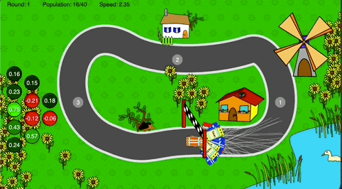
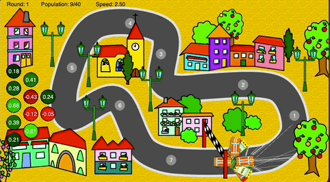
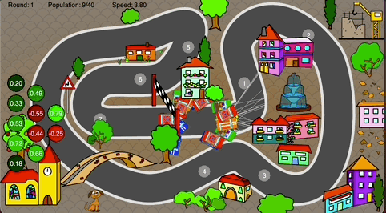
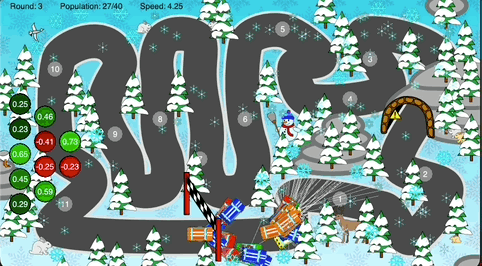
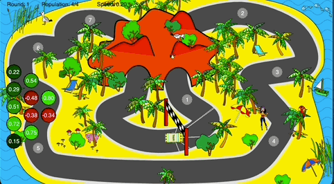

# NeuroDriver 🧬🚗

A fun **2D car simulation** that uses a **neural network** (built from scratch) to learn and navigate various racetracks.  
This project leverages **Python**, **Pyglet** for rendering, and **genetic/evolutionary algorithms** for training the neural network—no heavy ML frameworks used!

---

## Table of Contents

1. [Description](#description)
2. [Project Structure](#project-structure)
3. [Installation & Setup](#installation--setup)
4. [How It Works](#how-it-works)
5. [GIF Showcase](#gif-showcase)  <!-- Empty section to add animations later -->
6. [Usage](#usage)
   - [Training on Routes 0–3](#training-on-routes-03)
   - [Testing on Route 4](#testing-on-route-4)
7. [Makefile Targets](#makefile-targets)
8. [License](#license)
9. [Contact](#contact)

---

## Description

In **NeuroDriver**, small cars drive around a racetrack. Each car has a simple **feed-forward neural network** controlling acceleration and steering. The system uses a **genetic algorithm** to evolve better-performing networks over multiple generations.  

- **ML/DL Concepts**:  
  - Custom neural network architecture (`network.py`)  
  - Genetic algorithm approach (`evolution.py`)  
  - Selection, crossover, and mutation are all done manually—demonstrating the fundamentals without large libraries.  

- **Tech Stack**:  
  - **Python** (3.x)  
  - **[Pyglet](https://pyglet.readthedocs.io/en/stable/)** for rendering  
  - **[Json](https://docs.python.org/3/library/json.html)** for saving/loading “brains” (`brain.json`)  
  - **[Make](https://www.gnu.org/software/make/)** for build automation (optional, but convenient)  

---

## Project Structure
```bash
NeuroDriver/
│
├── game/
│   ├── car.py         # Car logic, radar, collision checks
│   ├── canvas.py      # Main rendering window & simulation loop
│   ├── hud.py         # Heads-up display rendering
│   └── racetrack.py   # Loads track images & checkpoint data
│
├── neural/
│   ├── network.py     # Feed-forward neural network
│   └── evolution.py   # Genetic algorithm (selection, crossover, mutation)
│
├── utils/
│   └── storage.py     # Save/load “brain” (serialized chromosomes) from JSON
│
├── scripts/
│   ├── training.py    # Main script for training on routes 0–3
│   └── testdrive.py   # Script to test the model on route 4
│
├── images/
│   ├── car0.png
│   ├── car1.png
│   ├── car2.png
│   ├── car3.png
│   ├── car4.png
│   ├── parkinglot.png	
│   ├── track0.png
│   ├── track0-overlay.png
│   ├── track0.json    # Contains checkpoints & track data
│   └── ... etc ...
│
├── assets/
│   ├── route_0.gif
│   ├── route_1.gif
│   ├── route_2.gif
│   ├── route_3.gif
│   ├── route_4.gif
│
├── screenshots/
│   └── different_states_of_the_car 
│
├── requirements.txt   # Python dependencies (pyglet, etc.)
├── Makefile           # Build automation & commands
├── README.md          # Project documentation
└── brain.json         # Saved best chromosomes from training

```

## Installation & Setup

1. **Clone the Repository**  
   ```bash
   git clone https://github.com/your-username/NeuroDriver.git
   cd NeuroDriver
   ```

2. Create Virtual Environment & Install Dependencies
   - Recommended approach using the Makefile:
   - Or do it manually:
3. Check Dependencies
   - pyglet
   - flake8 (for linting, optional)
   - pytest (for tests, optional if you wrote tests)
   - Any other packages needed (specified in requirements.txt)

## How It Works
NeuroDriver simulates a population of cars, each with a small neural network controlling steering and acceleration. The system uses a genetic algorithm to evolve better drivers over multiple generations:

1. Neural Network (network.py):
   - Layers of weights connecting inputs (radar distances) to outputs (steering & acceleration).
   - Uses tanh activation for each neuron.
3. Genetic Algorithm (evolution.py):
   - Selection: Keeps the top-performing networks (based on how many checkpoints they passed + distance from track edges).
   - Crossover: Mixes the weights of “parent” networks to produce new “child” networks.
   - Mutation: Occasionally randomizes some weights to avoid local minima.
5. Simulation (canvas.py & car.py):
   - Each car is spawned on the track.
   - If a car leaves the track boundaries, it’s shut off.
   - Each checkpoint passed improves that network’s “fitness.”
   - After all cars finish or crash, the best networks get selected for the next generation.

## GIF Showcase

### Training on routes 0 to 3

<p align="center">
  <figure style="display:inline-block; margin: 20px; text-align:center;">
    <figcaption>Route 0</figcaption>
    
  </figure>
  <figure style="display:inline-block; margin: 20px; text-align:center;">
    <figcaption>Route 1</figcaption>
    
  </figure>
  <figure style="display:inline-block; margin: 20px; text-align:center;">
    <figcaption>Route 2</figcaption>
    
  </figure>
  <figure style="display:inline-block; margin: 20px; text-align:center;">
    <figcaption>Route 3</figcaption>
    
  </figure>
</p>

### Testing on an unseen route 4

<p align="center">
  <figure style="display:inline-block; margin: 20px; text-align:center;">
    <figcaption>Route 4</figcaption>
    
  </figure>
</p>


## Usage
1. Training on Routes 0–3
   - Update training.py (if needed) to set the desired track indices (e.g., Track(0), Track(1), etc.).
   - Run training:
     ```bash
     # Option A: Using the Makefile
     make train
      
     # Option B: Directly with Python
     python3 scripts/training.py
     ```

     This will:
       - Remove the existing brain.json (if any) to start fresh (see updated Makefile below).
       - Generate multiple generations until the max limit or until you close the window.
       - Save the best-performing chromosomes back into brain.json.

3. Testing on Route 4
   - Once training completes and brain.json is saved:
     ```json
      python3 scripts/testdrive.py
     ```
   - This loads the best chromosomes from brain.json.
   - Spawns multiple cars on route 4 (which they haven’t seen during training).
   - Watch how well the trained model generalizes to the new track!
  
## Makefile Targets
```bash
# Define variables for clarity and easy customization
PYTHON      = python3
PIP         = pip3
VENV_DIR    = venv
TRAIN_SCRIPT = scripts/training.py
TEST_SCRIPT  = scripts/testdrive.py

# Declare targets that don't represent files
.PHONY: help venv install run train test lint clean

# Display usage information
help:
	@echo "Usage: make [target]"
	@echo "Targets:"
	@echo "  venv    - Create a virtual environment"
	@echo "  install - Install dependencies from requirements.txt"
	@echo "  run     - Run the main training script"
	@echo "  train   - Remove brain.json and then train from scratch"
	@echo "  test    - Run the testdrive on track 4"
	@echo "  lint    - Lint the code using flake8"
	@echo "  clean   - Remove virtual environment, brain.json, and __pycache__ directories"

# Create a virtual environment if it doesn't exist
venv:
	@if [ ! -d "$(VENV_DIR)" ]; then \
		$(PYTHON) -m venv $(VENV_DIR); \
		echo "Virtual environment created in $(VENV_DIR)"; \
	else \
		echo "Virtual environment already exists."; \
	fi

# Install dependencies using pip inside the virtual environment
install: venv
	$(VENV_DIR)/bin/$(PIP) install -r requirements.txt

# Run your main Python program (default to training script)
run: venv
	$(VENV_DIR)/bin/$(PYTHON) $(TRAIN_SCRIPT)

# Remove brain.json and then train from scratch
train: clean_brain run

# Test (the script that uses route 4)
test: venv
	$(VENV_DIR)/bin/$(PYTHON) $(TEST_SCRIPT)

# Lint your code with flake8 (or another linter of your choice)
lint: venv
	$(VENV_DIR)/bin/flake8 .

# Clean up the virtual environment, brain.json, and __pycache__ directories
clean: clean_brain
	rm -rf $(VENV_DIR)
	find . -type d -name "__pycache__" -exec rm -rf {} +
	@echo "Cleaned up virtual environment and __pycache__ directories."

# Separate target to clean brain.json (without removing venv)
clean_brain:
	rm -f brain.json
	@echo "Removed brain.json (if it existed)."
```

## License
MIT License


